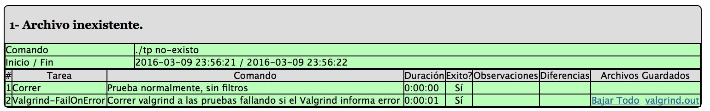
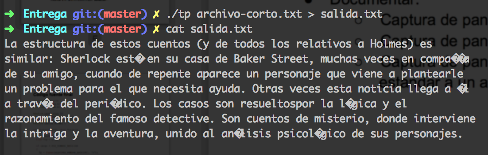

% Informe del Trabajo Práctico 0
% Alumno: Gavrilov Vsevolod
% Padrón: 96252


---

## Paso 1: Comenzando

 - Valgrind es una herramienta que permite analizar dinámicamente los programas.
 Es de ayuda para, por ejemplo, detectar leaks de memoria.

 - `sizeof` es una función que retorna la cantidad de bytes ocupados por una
 variable o necesarios para una variable del tipo especificado. La salida siempre
 depende de la arquitectura, por ejemplo en una arquitectura de 32 bits un int
 ocupará 4 bytes y un char - 1 byte.


```C
    sizeof(char); // 1
    sizeof(int); // 4
```

  - La afirmación *"El sizeof() de una struct de C es igual a la suma del sizeof() de cada uno de los elementos de la misma"* es falsa, ya que en un struct tambien se tienen en cuenta
  los paddings entre los elementos de structs. Se puede ver en este ejemplo:


```C
    struct S {
        char  c; /* 1 byte */
                 /* 1 byte de padding */
        short s; /* 2 bytes */
    };
```

{width="60%"}


---

## Paso 2: SERCOM - Error de compilación

Los errores resultantes fueron:

```
p2.c: In function 'main':
p2.c:10: error: implicit declaration of function 'ztrcpy'
p2.c:14: error: implicit declaration of function 'malloc'
cc1: warnings being treated as errors
p2.c:14: error: incompatible implicit declaration of built-in function 'malloc'
make: *** [p2.o] Error 1
```

Son errores del compilador. Se deben a que el compilador al pasar por las líneas
de error encontró funciones que todavia no están declaradas: `ztrcpy` y `malloc`
en este caso.


---


## Paso 3: SERCOM - Normas de programación y código de salida


Una de las pruebas realizadas por el SERCOM es la verificación del estilo del
código. En la captura de pantalla se ve que la mayoria de los errores se debe
a que faltan o sobran espacios en blanco. El único error que no tiene que ver con
espacios alienta a usar la función *snprintf* en vez de *strcpy*.


La primer prueba falló por un error en el código: al no existir un archivo la prueba
espera el código 1, pero el programa en este caso devuelve 2.


---


## Paso 4: SERCOM - Pérdida de memoria





Lo que se puede ver en los errores de valgrind resultantes (ver la figura \ref{errores_valgrind}) es que hay pérdida
de memoria. Valgrind nos avisa cordialmente que hay 2 *allocs* y 0 *frees*, y que
seguro perdemos 4 bytes de memoria en la linea 20 de la función main (donde
justamente hay un alloc de tamaño de un int).


---


## Paso 5: SERCOM - Escrituras fuera de rango


El problema de la prueba 3 se debe a que el nombre del archivo pasado al programa
supera el buffer definido de 20 caracteres, pero la función `strcpy` no respeta
ese límite y sigue escribiendo caracteres lo cual provoca resultados inesperados.
Se puede solucionar con la función `strncpy`, ya que sirve para el mismo proposito
(copia de strings) pero además de los argumentos de `strcpy` recibe un la cantidad
de bytes a copiar.


Valgrind (ver la figura \ref{errores_valgrind_2}) nos da una pista para diagnosticar ese problema: se ve en su mensaje de
salida que detectó un buffer overflow y apunta a que ocurre en *string3.h*, de
donde se puede sospechar que es un problema que tiene que ver con como estamos
manejando strings.

**Segmentation fault** es un error originado por intentos de acceso a segmentos
inaccesibles. Por ejemplo, ocurre al tratar de leer un segmento asignado a otro
programa, o tratar de escribir en el segmento de código.

**Buffer overflow** es un error que ocurre al escribir datos fuera del rango de
un buffer. Cabe aclarar que no es un error por si solo, sino que provoca que el
programa pueda dar resultados inesperados.


### Contenido del archivo corto:
*Entrada de la prueba 2*

```
La estructura de estos cuentos (y de todos los relativos a Holmes) es
similar: Sherlock est· en su casa de Baker Street, muchas veces en compaÒÌa
de su amigo, cuando de repente aparece un personaje que viene a plantearle
un problema para el que necesita ayuda. Otras veces esta noticia llega a Èl
a travÈs del periÛdico. Los casos son resueltospor la lÛgica y el
razonamiento del famoso detective. Son cuentos de misterio, donde interviene
la intriga y la aventura, unido al an·lisis psicolÛgico de sus personajes.
```


### Contenido del archivo largo
*Entrada de la prueba 4*

```
Rene Geronimo Favaloro (La Plata, Argentina, 12 de julio de 1923 - Buenos
Aires, Argentina, 29 de julio de 2000) fue un prestigioso medico cirujano
toracico argentino, reconocido mundialmente por ser quien realizo el primer
bypass cardiaco en el mundo. Estudio medicina en la Universidad de La Plata
y una vez recibido, previo paso por el Hospital Policlinico, se mudo a la
localidad de Jacinto Arauz para reemplazar temporalmente al medico local,
quien tenia problemas de salud. A su vez, leia bibliografia medica
actualizada y empezo a tener interes en la cirugia toracica. A fines de la
decada de 1960 empezo a estudiar una tecnica para utilizar la vena safena
en la cirugia coronaria. A principios de la decada de 1970 fundo la
fundacion que lleva su nombre. Se desempeno en la Conadep, condujo
programas de television dedicados a la medicina y escribio libros.
Durante la crisis del 2000, su fundacion tenia una gran deuda economica y
le solicito ayuda al gobierno sin recibir respuesta, lo que lo indujo a
suicidarse. El 29 de julio de 2000, despues de escribir una carta al
Presidente De la Rua criticando al sistema de salud, se quito la vida de un
disparo al corazon.
```

### Comando para la ejecución de la prueba 3

```bash
./tp soy-un-archivo-con-nombre-largo.txt
```


---


## Paso 6: SERCOM - Entrada estándar


---


## Paso 7: SERCOM - Entrega exitosa





