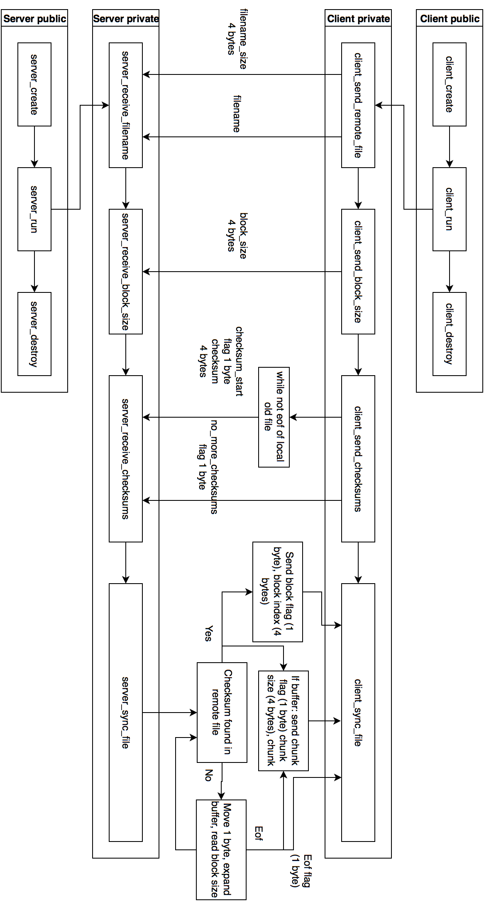

% Informe del Trabajo Práctico 2
% Alumno: Gavrilov Vsevolod
% Padrón: 96252

---

# Sincronización de archivos

### Objetivo

El trabajo práctico busca crear un programa que pueda realizar la
sincronización entre dos archivos, uno local y uno remoto. El propósito de ese
programa será actualizar el archivo local con los cambios del archivo remoto,
utilizando la menor cantidad de recursos para la comunicación. Se propone
generar dos actores: un servidor y un cliente, los cuales mediante sockets
realizarán la actualización del archivo utilizando un protocolo específico.

### Implementación

Como una de las premisas es el disminuir el uso de recursos, no se puede simplemente enviar todo el contenido del archivo desde el servidor hacia el cliente. Es necesario un enfoque más inteligente. Lo que se propone hacer es que el cliente envie los checksums de los bloques del archivo local. Checksum es el resultado de una función de hashing que dada una cadena de caracteres devuelve un número lo más próximo a único posible, osea con una probabilidad muy baja de colisión. De esta manera se etaría avisando al servidor qué partes del archivo el cliente ya tiene y no es necesario que se envíen desde el servidor. La ventaja de eso es que para la actualización solo se va a necesitar enviar las partes nuevas, para el resto de los bloques el servidor va a poder marcarle al cliente de usar los que ya tiene.

Basándose en eso, se puede definir cómo se va a realizar la comunicación. El servidor va a abrir un socket y escuchar en un puerto específico la conexión de un cliente. Una vez conectados, el cliente deberá enviar el nombre del archivo remoto, el tamaño del bloque de a cual se van a calcular los checksums y luego todos los checksums que tiene presente en el archivo local. Una vez hecho eso, el servidor va a pasar a recorrer el archivo remoto y le va a enviar al cliente las partes nuevas del archivo o indicarle que utilice las partes ya existentes. Eso se puede lograr sacando checksums para bloques del archivo remoto, revisando si están entre los que el cliente ya envió y, en el caso de encontrarlos, enviarle que parte de archivo local el cliente tiene que usar. La ventaja de eso es visible para archivos grandes y usando bloques de tamaño de orden de varios kilobytes: en lugar de enviar kilobytes de datos el cliente envía un checksum de 4 bytes y el servidor le responde con un índice de 4 bytes.

### Detalles técnicos

En este trabajo práctico se empleó una abstracción para el cliente y para el servidor. Las únicas funciones públicas en los dos casos son las de construcción, destrucción y una función para realzar el proceso de comunicación.

Para socket también se creó una extensión para reutilizar código y usar una abstracción de más alto nivel (ya que la API de sockets de C es bastante incómoda de utilizar). En esta abstracción hay varias funciones públicas, tales como la creación y destrucción, la lectura y la escritura, el bind y listen, accept y connect.

Uno de los detalles dudosos es que para la conección al servidor mediante un hostname se proponen dos variantes: la función `gethostbyname` y la función `getaddrname`. Se han hecho pruebas y exitosas con ambas variantes, pero ambas en OS X tienen perdidas de memoria, y en SERCOM solo se aceptó la variante que usaba `gethostbyname`.

El protocolo de comunicación entre el cliente y el servidor se definió en un archivo separado. Este contenía las definiciones de flags necesarios para avisar sobre las acciones del cliente y del servidor. Además en el mismo archivo se define la función de checksum (es muy importante que se use la misma función en el cliente y el servidor).

Para guardar los checksums del lado del servidor se empleó una estructura de datos sencilla, llamada "bolsa" (bag). Se implementó como una lista enlazada, pero lo único que permite es guardar valores enteros secuencialmente, y luego buscarlos obteniendo su índice. Con eso alcanza para asegurar la sincronización del archivo correcta, ya que el cliente envía los checksums en orden.

### Esquema de comunicación entre el servidor y el cliente

