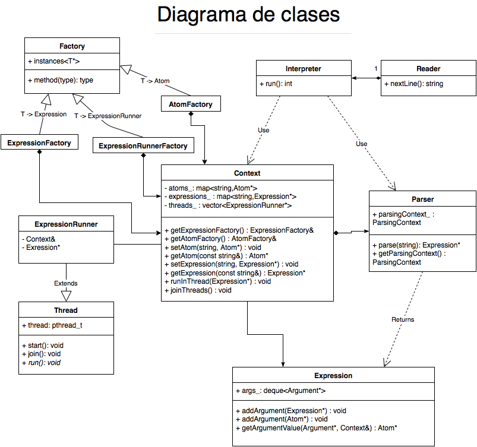
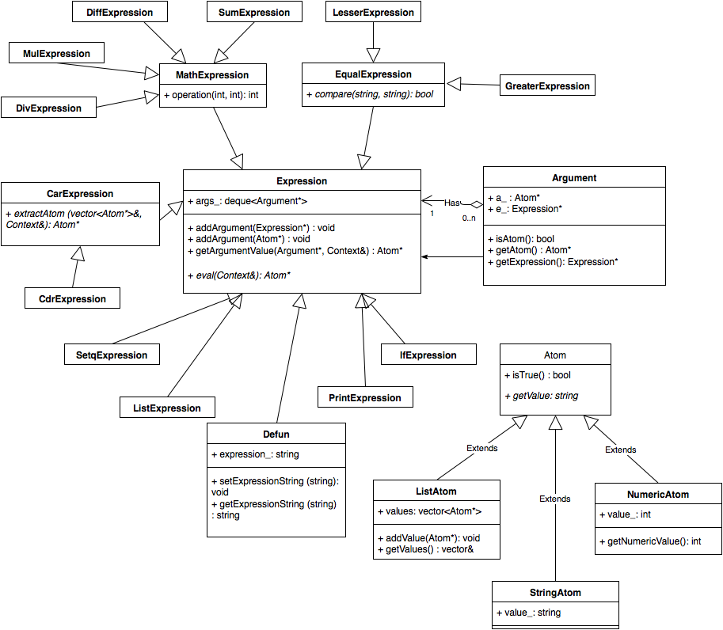

## Correcciones para la re-entrega

El principal cambio fue la protección de los datos que se utilizan desde hilos diferentes. Los puntos del programa que se veían afectados por ese problema son la definición de variables y funciones, porque se crean en diferentes hilos pero se guardan en un único lugar accesible para todos los hilos, y la expresión de impresión por pantalla. Para lograrlo se utilizó la clase `Mutex`, un wrapper alrededor del `pthread_mutex_t`. Esta clase expone métodos `lock` y `unlock`. Para utilizarlo de forma RAII, se agregó una clase `Lock`, que hace `lock` en el constructor y `unlock` en el destructor.

Entre otros cambios, se mejoró el código agregando `const` y referencias cuando se pasa un *string* por parámetro. También se sacaron las clases factories, y se usa directamente la clase template (por ejemplo, para las expresiones se usa `Factory<Exrepssion>` y el método `createObject` en vez de `ExrepssionFactory`. La clase `Argument` ahora devuelve el valor del argumento, y se ocupa de ejecutar la expresión si hace falta, en vez de exponer la expresión o el átomo.

También se separó el diagrama de clases en 2, uno para las clases en general y otro para las expresiones y átomos.

{width=602 height=502}

{width=608 height=530}
