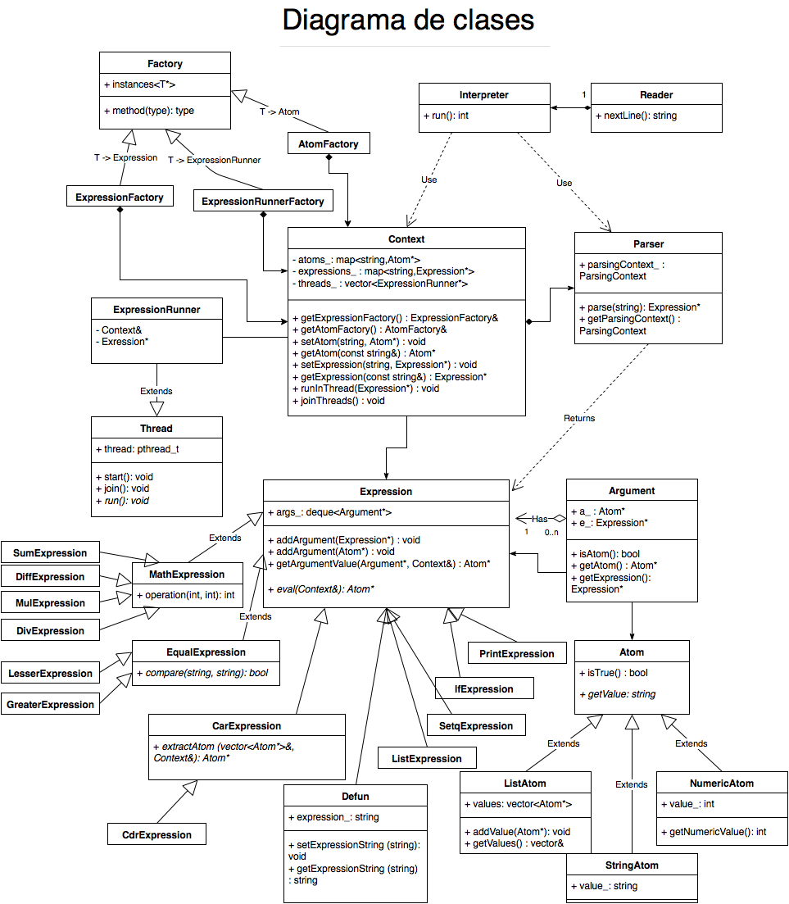

% Informe del Trabajo Práctico 2
% Alumno: Gavrilov Vsevolod
% Padrón: 96252


---


# Parrallel Lisp

## Objetivo

Este trabajo práctico busca crear un programa que pueda interpretar y ejecutar un subconjunto de instrucciones del lenguaje Lisp. Las instrucciones soportadas serán operaciones matemáticas y de manejo de listas, pero también se soportarán condicionales y definiciones de variables y funciones.
Para mejorar la performance del programa, todas las instrucciones se ejecutarán en un hilo aparte.


## Introducción

Los elementos del lenguaje Lisp se pueden dividir en **funciones** y **átomos**. Los átomos representan valores concretos, pueden ser numéricos o cadenas de caracteres. Dentro de átomos también se pueden considerar las listas (o también se pueden pensar como un elemento aparte, ya que a su vez contienen átomos). Algunos ejemplos:

```lisp
3                 ; un átomo numérico de valor 3
(list 1 2 3 4)    ; lista que almacena átomos numéricos
```

Las funciones realizan operaciones sobre los átomos que se les pasan por parámetro. Por ejemplo:

```
(+ 4 5)                         ; "+" devuelve la suma de los átomos 4 y 5
(append (list 1 2) (list 5 6))  ; "append" concatena las listas pasadas
                                ; y devuelve el resultado
```

`list` es una función también, que devuelve una lista con los valores que se le pasaron. Se puede ver como las ejecuciones se pueden anidar, y se comienza por la de mayor *profundidad*.

Las funciones que se requiere implementar son:

 - `(+ 1 2 3)     ; 6`

      Realiza la suma de los números pasados por parámetro.

 - `(- 20 10 5)   ; 5`

      Resta consecutivamente los números pasados, comenzando con el primero.

 - `(* 5 6 2)     ; 60`

      Multiplica los números.

 - `(/ 100 2 10)  ; 5`

      Toma el primer número y lo divide por los siguientes.

 - `(list 1 2 3)`

      Retorna una lista con los átomos pasados. Pueden ser tanto átomos comunes, como otras listas. Lista sin parámetros es una lista vacía, que tiene un significado particular: es el único valor que se considera **falso** para las instrucciones condicionales.

 - `(car (list 1 2 3))      ; 1`

      Devuelve el primer elemento de la lista.

 - `(cdr (list 1 2 3))      ; (2 3)`

      Devuelve todos los elementos salvo el primero

 - `(setq valor 1)`

      Guarda una variable con el nombre que se le asigna en el primer parámetro y el valor del segundo parámetro Las siguientes instrucciones podrán utilizar ese valor refiriéndolo con el nombre definido.

 - `(if 1 2 3)    ; 2`

      Evalúa el valor de verdad del primer parámetro. Si es verdadero, devuelve el segundo parámetro, si no el tercero. Como ya se mencionó, el único valor que se considera falso es la lista vacía.

 - `(print 1 2 3)   ;`

      Envía al standard output los valores pasados por parámetro.

 - Opcional: `(defun funcion (ENV) (+ ENV ENV))`

      Define una nueva función que toma un parámetro. Más adelante se podrá llamarla con el nombre que se le dio, pasándole un parámetro, y va a ejecutar la expresión definida en el tercer argumento, reemplazando donde hace falta los parámetros.

 - Opcionales: `(= 1 1)`, `(< 1 2)`, `(> 2 1)`.

      Comparan el primer parámetro con el segundo, y retornan 1 en el caso de que coincidan, o lista vacía en el caso contrario.


## Diseño

Se adaptaron dos premisas para diseño de este trabajo práctico:

 - Todos los elementos de las instrucciones son **Expresiones** o **Átomos**.

 - Las expresiones siempre devuelven un átomo.

De esta manera, la instrucción inicial es una expresión, que adentro puede
tener definidas otras expresiones o átomos. Las expresiones se pueden anidar, y a la hora de evaluar, como cualquier expresión devuelve un átomo, cada expresión ejecuta a las que contiene y utiliza su valor de retorno. Las expresiones que no se supone que devuelvan algo, como `print` o `sync`, devolverán una lista vacía.

Es necesario separar el parseo de la ejecución de cada expresión para lograr el objetivo - esa lógica se separa en entidad **Parser**. Parser toma cadenas de caracteres y retorna una expresión lista para ser evaluada. Como a la hora de parsear es imposible conocer el átomo que retorna una función (porque es producto de su ejecución), y a su vez un parámetro de una función puede ser el resultado de otra función - es necesario poder pasar como parámetro expresiones. Para eso se utiliza una entidad **Argument**, que puede ser un átomo o una expresión. Entonces, cada expresión puede tener una lista de argumentos y evaluarlos cuando sea necesario.

Como se pueden definir variables globales que se puedan utilizar en otras funciones, tiene sentido una entidad **Context**. El contexto será el lugar donde cada expresión podrá obtener el valor de una variable definida. Las funciones definidas con `defun` también se pueden pensar como variables.

Finalmente, como punto de entrada se utilizará la entidad **Interpreter**. En ella residirá la lógica referente a la creación del parser, lectura de la entrada y ejecución de las expresiones.

## Implementación

### Expresiones y Átomos

Todas las expresiones se implementaron por herencia de una clase virtual pura *Expression*. Esa clase define el método virtual `eval`, al que se le pasa un contexto y que devuelve un átomo. Este es el punto de entrada, mediante el cual todas las expresiones son ejecutadas.

La clase también posee de una lista de argumentos (se implementó como una `std::deque`) y unas funciones que ayudan a manejarlas. Por ejemplo, `getArgumentValue` devuelve el valor del argumento (un átomo), qué en el caso de ser una expresión se evalúa y se toma su valor de retorno.

La expresión también expone métodos para agregar expresiones o átomos como argumentos (utilizadas por el parser).

En el `eval` de las expresiones lo que se suele hacer es evaluar los argumentos, usar sus valores para realizar algún procesamiento y devolver un átomo con el resultado.

Para algunas expresiones se separó la lógica en otras clases base: como es el caso de las expresiones matemáticas o lógicas. La clase padre hereda de *Expression* y define el comportamiento y las clases hijas solo definen una operación a realizar entre dos valores.

Los átomos se implementaron de la misma forma. Hay una clase virtual pura *Atom* que define una función `getValue`, que retorna la representación del átomo como `string`. Los derivados, *StringAtom*, *NumericAtom* y *ListAtom* definen como se representan con una cadena, y definen otros getters: en el caso del número se define un `getNumericValue` y en el caso de la lista, un `getValues` que retorna un vector de elementos.

La clase base *Atom* también define un método `isTrue` que siempre retorna *true* y es sobrescrita por *ListAtom*, que retorna *false* en el caso de no tener valores.


### Contexto y Factories

La clase *Context* tiene varias responsabilidades en el programa. Primero, sirve para guardar variables (átomos y funciones). Esto se implementa con dos instancias de `map`, que utiliza como claves cadenas de caracteres. El contexto expone *getters* y *setters* para guardar o sacar átomos y expresiones.

Segundo, el contexto es la interfaz para la creación de nuevos átomos y expresiones. Expone las *fábricas* o *factories* para el uso externo.

La clase *Factory* es una clase template que se encarga de crear instancias de objetos del tipo especificado. Es definida de la siguiente manera:

```c++
template <class T>
class Factory {
  std::vector<T*> instances_;

public:
  template <class U>
  U* createObject() {
    U* var = new U();
    instances_.push_back((U*) var);
    return var;
  }
}
```

Se puede ver que la clase Factory requiere de un tipo base, y `createObject` opera sobre las clases derivadas, de otra manera no se podría compilar. Entonces la forma de utilizarla, por ejemplo, para crear expresiones es:

```c++
class ExpressionFactory : private Factory<Expression> {
public:
  PrintExpression* createPrint() {
    return createObject<PrintExpression>();
  }
}
```

Las factories tienen otro propósito: mantienen las referencias a las instancias creadas (se guardan en el vector `instances_` que, como se puede notar, guarda punteros a la clase padre). En el destructor de la factory (omitido en el cuadro de código) a todas las instancias creadas se les hace `delete`. De esta forma, la misma factory se ocupa de liberar los recursos pedidos. Por eso el nombre *Factory* probablemente sea equivocado, ya que no tiene tanto que ver con el patrón de diseño Factory.

Volviendo a las responsabilidades del contexto, éste tiene una factory para expresiones y otra para átomos, y las expone mediante getters. De esta manera el parser puede generar nuevas expresiones en el contexto global y las expresiones pueden generar átomos, por ejemplo.

Por último, el contexto es el responsable de iniciar una ejecución de una expresión en hilos. Esto es necesario para tener acceso a los hilos creados y poder hacerles *join* cuando sea requerido. También se les hace join cuando el contexto se destruye. Para eso el contexto tiene otra factory, para generar instancias de clases que corren las expresiones en hilos.

En esta implementación hay una única instancia del contexto - el contexto global, y se le pasa al parser y a la evaluación de cada expresión. Pero si se quisiera implementar un contexto local, no debería haber complicaciones.


### Parser

La clase *Parser* también tiene una única instancia y se ocupa de parsear una cadena que se le ingresa. Se le pasa el contexto global para generar los átomos y expresiones, y el parser sabe qué *token* a qué expresión corresponde.

La principal lógica del parser sigue el siguiente flujo:

  1. Se comienza parseando una expresión. Se verifica que comience y termine con un paréntesis.
  2. Se deduce el nombre de la expresión y se genera una instancia.
  3. Se recorre el resto de la cadena.
      i. En el caso de encontrar un paréntesis, se recorre hasta el último paréntesis y la cadena resultante se parsea recursivamente, retornando una expresión, que se le agrega como argumento a la instancia inicial. A la hora de buscar el último paréntesis, es necesario de llevar la cuenta de paréntesis abiertos. Cada paréntesis abierto necesita un cierre.
      ii. En el otro caso, a partir del token encontrado se genera un átomo y se le agrega como argumento a la instancia.
  4. Se retorna la instancia.

Este flujo sirve para las expresiones básicas, pero falla para las expresiones como `setq` y `defun`, o para el llamado a funciones. Para estos casos el parser mantiene un estado llamado *ParsingContext*. Es definido de la siguiente manera:

```c++
enum ParsingContext {
  CommonExpression,
  Setq,
  Sync,
  Defun,
  Fun
};
```

El estado común es *CommonExpression*, pero cuando se genera una expresión *Setq* o *Defun*, el parser altera el contexto y luego en el parseo actúa de una forma acorde. Por ejemplo, cuándo se define una variable con Setq de la siguiente manera:

```lisp
(setq variable 1)
```

El nombre de la variable no se busca entre las variables ya definidas (como pasaría si el contexto fuese otro), sino que se crea un átomo con el valor `variable` y se le pasa a la expresión Setq.

El contexto de parseo también se expone para afuera, para que el interprete pueda saber si se creó una expresión `sync`, para ejecutarla en el hilo principal.


### Interprete, Reader e hilos

El interprete es una instancia de *Interpreter*. Expone el método `run` y toma en el constructor un *Reader*.

El reader se ocupa de obtener línea por línea lo que hay que parsear y ejecutar. Si bien, este trabajo se evalua pasando la entrada por standard input, se puede fácilmente crear un reader que lea de un archivo, por ejemplo.

El interprete en el método run genera un contexto, que será global a la ejecución. A medida que parser le va devolviendo las expresiones, el interprete decide si hay que mandarlos a un hilo (con el método que le expone el contexto) o evaluarlas en el hilo principal (caso del sync).

Para los hilos se creó la clase *Thread* que encapsula los llamados a métodos de `pthread`, y expone un método `start`, `join` y un método virtual `run`, al que se va a llamar cuando un hilo se mande con `start`.

La evaluación de las expresiones en un hilo se encapsula en la clase *ExpressionRunner* que hereda de *Thread*. Se le asigna una expresión y un contexto, y en el run simplemente se evalúa esa expresión en el contexto pasado.


## Problemas y resoluciones

Uno de los problemas más grandes fue el diseño, para el cuál era necesario contemplar desde el principio los casos más complejos. Diseños simplistas que servirían para los casos sencillos, tales como expresiones matemáticas y salida por pantalla, podrían no servir para las expresiones más complejas. Las premisas tomadas en el diseño fueron claves para la implementación posterior.

Al principio se diseño el problema sin el uso del *heap*, usando solo las variables en *stack*. Pero pronto se enfrentó con la necesidad de tener polimorfismo para evaluar las expresiones, lo cuál va de la mano con la necesidad de crear objetos dinámicamente y tener claro el momento de su destrucción. Ahí surgió la idea de tenerlo en un solo lugar, y para ese propósito se crearon las Factories.

Un problema particular fue con la expresión *Defun* y el posterior llamado a las funciones definidas. Al principio se intentó crear la expresión al momento de evaluar el Defun. Para eso a las expresiones se les asignó un parámetro *lazy*, que a la hora de evaluar el Defun se creaba (cuando se encontraba con un `ENV`) y se agregaba a la cola de argumentos, y cuando se hacia el llamado, se le asignaba valor. Para sostener este enfoque, se generó código extra en la parte del parseo, contemplando esos casos - pero igual no era viable para casos más complejos (por ejemplo, llamado a una función durante la definición).

La solución fue tomar un enfoque completamente diferente: Defun pasó a guardar la cadena de texto de la expresión a ejecutar y se guardaba a si mismo en el contexto bajo la clave pasada. Es decir

```lisp
(defun funcion (ENV) (+ ENV ENV))
```

Guarda la expresión Defun en el contexto global bajo la clave `funcion`.

Luego, al momento de hacer llamado a la función, el parser obtiene la expresión defun, le pasa los parámetros como una cadena de caracteres y el Defun retorna una nueva string de una expresión, donde los `ENV` son reemplazados por los parámetros. Esa cadena resultante es la que el parser utiliza para generar la expresión final. Este enfoque resultó ser más sencillo de implementar y con menos código.

## Conclusiones

Este trabajo ha sido de suma utilidad e interés para entender conceptos básicos de C++ y aprender a modelar el problema teniendo en cuenta dichos conceptos. Se tuvo que lidiar con un problema recursivo y con la necesidad de tener en cuenta el tiempo de vida de cada objeto, lo cuál fue crucial para el diseño del mismo.

Lamentablemente, el tiempo asignado fue poco y mal usado. Esto llevó a que quedó código que se podría reutilizar, la solución podría haber sido más elegante, no se llegó a documentar el código y generar diagramas acordes para entender mejor el programa final.


{width=535 height=613}


