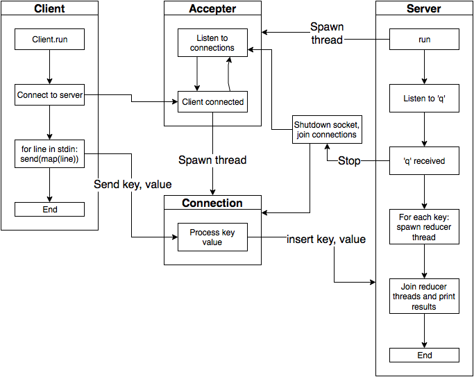

% Informe del Trabajo Práctico 3
% Alumno: Gavrilov Vsevolod
% Padrón: 96252


---


# MapReduce

## Objetivo

Este trabajo práctico tiene como propósito crear un programa que calcule la temperatura máxima de cada día a partir de los datos de temperatura de diferentes ciudades para un mes. Esto se llevará a cabo mediante la técnica **Map Reduce**, donde los clientes realizarán el *map* de datos y le enviarán el resultado al servidor, el cuál creará las entidades necesarias para hacer el *reduce* y mostrará el resultado.

## Introducción

El **Map Reduce** es un paradigma inventado y popularizado por *Google* y describe una manera de paralelizar ejecución de un algoritmo, separándolo en dos instancias: *map* y *reduce*. El objetivo de esto es poder escalar la ejecución horizontalmente en diferentes máquinas.

El propósito del *map* es tomar una lista de datos con una clave y un valor, y para cada par clave y valor generar otro par que puede ser diferente. El objetivo del *reduce* es tomar una lista valores y reducirla a un valor.

En este trabajo práctico, cada cliente recibirá una entrada con varias líneas con la siguiente forma:

```
Ciudad Temperatura Día\n
```

El cliente tendrá que procesarla y por cada línea le enviará al servidor un par de clave valor. El servidor a su vez tendrá que tomar los datos de los clientes hasta que por la entrada estándar le llegue una letra 'q'. Una vez que se ingresa la 'q', el servidor terminará de aceptar conexiones, y por cada día recibido creará un hilo *Reducer*. El propósito de ese hilo será procesar una lista de valores y devolver la o las ciudades con la mayor temperatura. Finalmente, el servidor tendrá que imprimir por pantalla las ciudades más calurosas con el siguiente formato:

```
Día: Ciudad (Temperatura)\n
```


## Implementación

### Socket

Los sockets se utilizan tanto por el cliente, como por el servidor. Para utilizar sockets se creó una clase `Socket`, que wrapea al socket de C y presta una interfaz de alto nivel para usarlo. Expone funciones para conectarse a un puerto y un host, escuchar, *bindearse* a un puerto, leer, escribir y cerrar la conexión.

La escritura recibe un *string*, y la lectura lee una línea (es decir, lee hasta encontrarse con un salto de línea). Otro detalle es que el Socket tiene dos constructores, uno sin parámetros que llama a `socket_create` adentro y otro que toma como parámetro un *file descriptor*. Este último se usa para los casos de conexiones aceptadas (el *accept* devuelve el file descriptor a partir del cuál se instancia el Socket).

### Threads

Para los hilos se usó una abstracción que adentro utiliza `pthread`. La clase `Thread` es virtual pura, expone métodos `join` y `start` y los hijos deben sobrescribir el método virtual `run`, el cual se va a ejecutar en otro hilo cuando a la instancia se le ejecute el método start.

También se utilizaron abstracciones `Mutex` y `Lock`. El primero es un wrapper alrededor de `pthread_mutex_t` y expone métodos `lock` y `unlock`. La segunda se utiliza para usar el mutex de manera RAII: se crea con una referencia a un mutex, en el constructor le hace `lock`, y en el destructor - `unlock`.


### Cliente

La implementación del cliente es sencilla: es una clase `Client` que expone el método `run` (que es el punto de entrada). Ese método se conecta al servidor, y a cada  línea leída de la entrada estándar le hace un `map` y envía el resultado al servidor. El `map` convierte la línea en una cadena de tipo `día ciudad temperature` y lo realiza otra clase sencilla, `Mapper`.


### Servidor

El punto de entrada del servidor es el método `run` de la clase `Server`. Este método se ocupa, en un principio, de crear una instancia de clase `Accepter` para recibir las conexiones y ponerse a escuchar la entrada estándar en espera de una 'q'. El servidor le pasa al aceptador una referencia a un contenedor para guardar los valores entrantes. Para este propósito se utilizó la estructura de datos `std::multimap`, que permite guardar pares clave valor, y para una misma clave permite tener varios valores - ideal para guardar varias temperaturas para un día.

`Accepter` es una clase que hereda de `Thread` y tiene un socket. En el `run` el aceptador acepta conexiones a ese socket, y por cada conexión entrante genera una instancia de clase `Connection`.

La conexión también es una clase que hereda de `Thread`. Cada conexión recibe el *file descriptor* del socket cliente, y una referencia al aceptador. Se ocupa de leer el socket hasta encontrar un `End\n`, y por cada línea genera un par, con el día como clave y el resto del string como valor, y lo guarda en el `multimap` que creó el servidor mediante un método que expone el aceptador. Para que la escritura sea segura, el aceptador tiene un mutex, y crea un `Lock` antes de guardar el par.

Cuando el servidor recibe una 'q', llama al método `stop` del aceptador y luego le hace `join`. En el método `stop` el aceptador cierra el socket que acepta conexiones y joinea los hilos de conexiones. El paso siguiente para el servidor es hacer *reduce*. Lo hace usando las claves y valores que se guardaron en el `multimap`: por cada clave (día) se crea una instancia del `Reducer` y se le pasan los valores que están para esa clave.

`Reducer` es un `Thread` y se ocupa de hacer la comparación de las temperaturas y quedarse con la más alta. Por la posibilidad del empate, las ciudades se van guardando en vector, para luego hacerle `std::sort`. El resultado se guarda en cada reducer.

Una vez creados e ejecutados todos los hilos reducers, el servidor espera a que terminen e imprime el resultado de cada uno. Para que se impriman en orden, cada hilo de reduce se guarda en un `std::map`, cuyos claves son los días enteros. Como el `map` tiene orden, a la hora de recorrerlo voy a obtener los días del primero al último.


---


{width=546 height=490}


